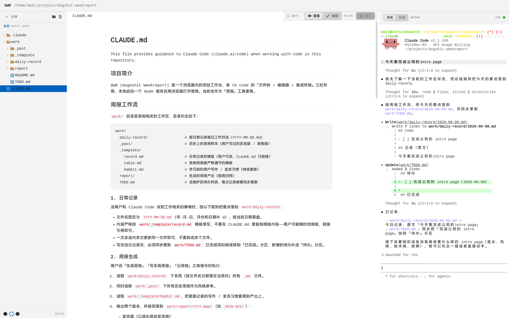
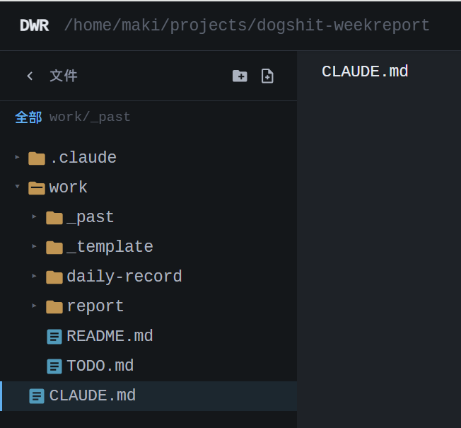
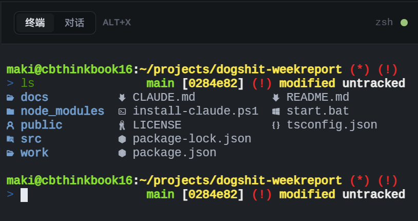

# DWR — Dogeshit Weekreport

[](LICENSE)
[](https://nodejs.org/)
[](package.json)

方便快捷地记录每天做了什么，让 AI 协助写周报，减少因周报造成的精神损失。

## 截图

### 主界面



### 文件树



### 编辑器



## 界面布局

```
┌─────────────────┬────────────────────────────┬─────────────────┐
│                 │                            │  [终端] [对话]   │
│    文件树        │         编辑器              │  Alt+X 切换      │
│                 │                            ├─────────────────┤
│  浏览 / 新建     │  预览 Markdown 或编辑源码     │                 │
│  删除文件        │  Alt+E 查看 ↔ 编辑           │  终端：系统      │
│                │  Alt+F 全屏                  │  Shell         │
│  默认聚焦       │  Ctrl+S 保存                 │                │
│  work/ 工作区   │                             │  对话：Claude   │
│                 │                            │  Code CLI       │
└─────────────────┴────────────────────────────┴─────────────────┘
     左侧                    中间                        右侧
```

右侧顶部可点「终端 / 对话」切换，也可用快捷键 **Alt+X**。

## `work/` 目录结构

```
work/
  TODO.md             ← 活维护的待办列表（有变动就同步更新）
  daily-record/       ← 每日工作记录，文件名 YYYY-MM-DD.md
  _template/
    record.md         ← 日常记录模板（可自行修改）
    table.md          ← 表格周报模板（生成表格版周报时严格遵守）
    habbit.md         ← AI 学习到的你的写作 / 发言习惯
  _past/              ← 历史周报样本，供 AI 参考你的风格和措辞
  report/             ← 让ai写周报就在这，按周归档（如 2026-W23/）
```

## 快捷键

| 快捷键 | 作用 |
| ------ | ---- |
| **Alt+X** | 终端 ↔ 对话（Claude Code）切换 |
| **Alt+E** | 查看 ↔ 编辑 模式切换 |
| **Alt+F** | 编辑器全屏 / 退出全屏 |
| **Alt+D** | 切换主题（dark / light / one-dark）；未手动选过主题时会跟随系统亮暗 |
| **Ctrl+S** | 保存当前文件（Mac 为 **Cmd+S**） |

左下主题圆点也可直接点选；面板宽度可拖拽分隔条调整。

## 快速开始

### 环境要求

- Node.js >= 18
- [Claude Code CLI](https://docs.anthropic.com/en/docs/claude-code)（使用「对话」功能时需要）

### Windows

双击 [`start.bat`](start.bat)，会自动检查依赖与 Claude CLI，并启动开发服务、打开浏览器。

### 命令行

```bash
npm install
cp .env.example .env   # 按需修改
npm run dev
```

浏览器访问控制台输出的地址，默认 `http://127.0.0.1:4721`。

生产构建：

```bash
npm run build
npm start -- --cwd /path/to/project --port 4721
```

### 配置

复制 [`.env.example`](.env.example) 为 `.env`：

| 变量 | 说明 |
| ---- | ---- |
| `DWR_HOST` | 监听地址，默认 `127.0.0.1` |
| `DWR_PORT` | 端口，默认 `4721` |
| `DWR_ALLOWED_IPS` | 允许访问的客户端 IP，逗号分隔 |
| `ANTHROPIC_BASE_URL` / `ANTHROPIC_API_KEY` / `ANTHROPIC_MODEL` | Claude 对话连接（其余见 `.claude/settings.json`） |

## 快捷键

| 快捷键 | 作用 |
| ------ | ---- |
| **Alt+X** | 终端 ↔ 对话切换 |
| **Alt+E** | 查看 ↔ 编辑 |
| **Alt+F** | 编辑器全屏 |
| **Alt+D** | 切换主题 |
| **Ctrl+S** | 保存（Mac：**Cmd+S**） |

## 项目结构

```
├── public/          # 前端静态资源
├── src/             # 后端 TypeScript（Express + WebSocket + node-pty）
├── work/            # 周报工作区（日常记录、模板、产出）
├── start.bat        # Windows 一键启动
└── .env.example     # 环境变量示例
```

## License

MIT
